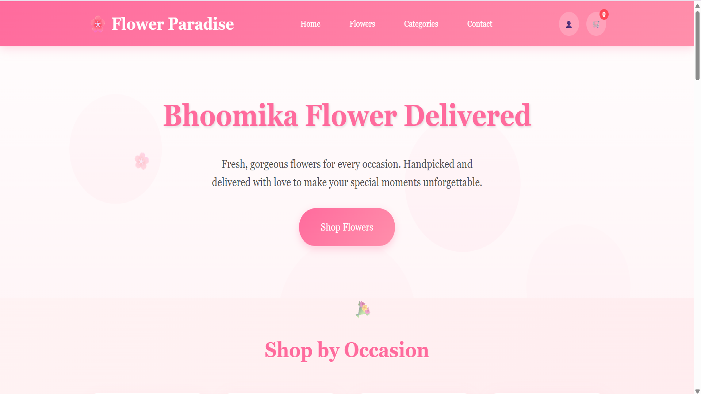
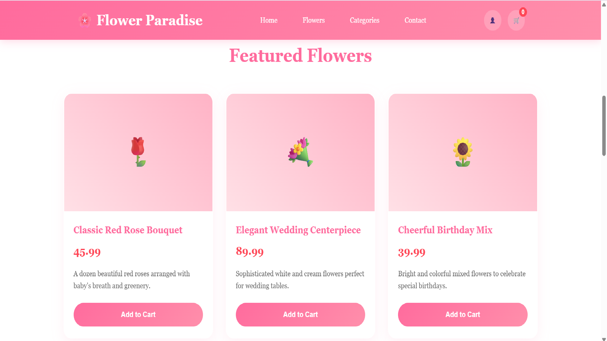
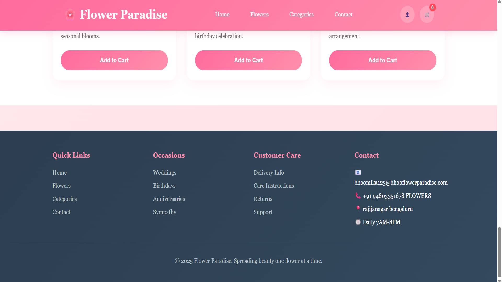
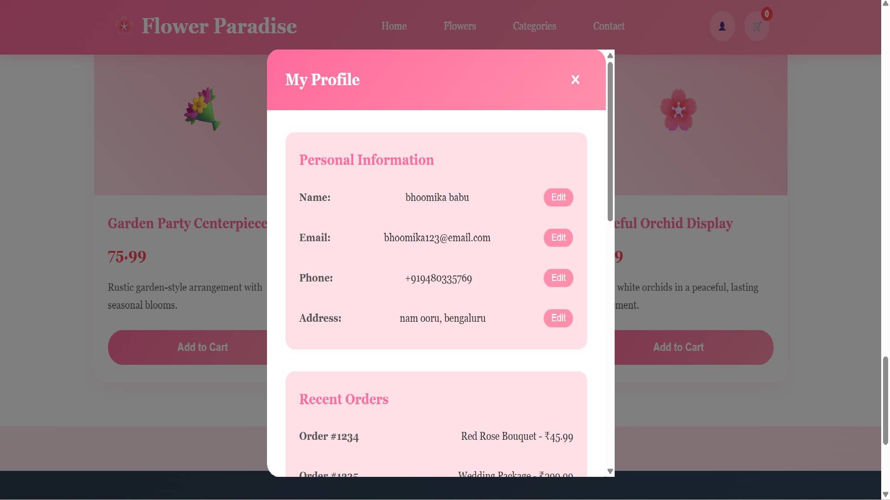

## 🌟 Key Sections:

**Project Header** - Beautiful badges and title <br>
**Live Demo Link** - Placeholder for GitHub Pages<br>
**Screenshots Section** - Space for project images<br>
**Detailed Features List** - All functionality covered<br>
**Technologies Used** - Clean table format<br>
**Project Structure** - File organization<br>
**Quick Start Guide** - Installation instructions <br>
**Customization Guide** - How to modify colors, products <br>
**Responsive Design Info** - Device compatibility<br>
**Browser Support** - Compatibility matrix<br>
**Performance Metrics** - Loading speeds<br>
**Deployment Options** - GitHub Pages, Netlify, Vercel <br>
**Contributing Guidelines** - How others can help <br>
**Future Enhancements** - Planned features <br>
**MIT License** - Full license text <br>
**Author Info** - Your contact details <br>
**Acknowledgments** - Credits and inspiration <br>

## 📝 To Use This README:

### Replace Placeholders:
```
yourusername → Your GitHub username
your.email@example.com → Your actual email
Update LinkedIn and other social links
```

## Add Screenshots:

 &nbsp;&nbsp;&nbsp;  <br>
 &nbsp;&nbsp;&nbsp;  <br>


**Update Live Demo:** [Click Here](https://bhoomika0620.github.io/shopping_website/shopping_website.html)

